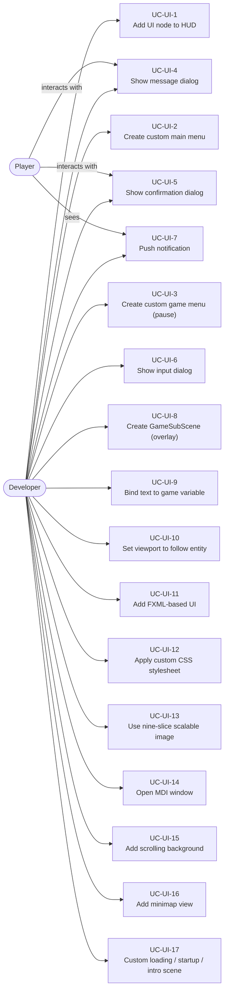
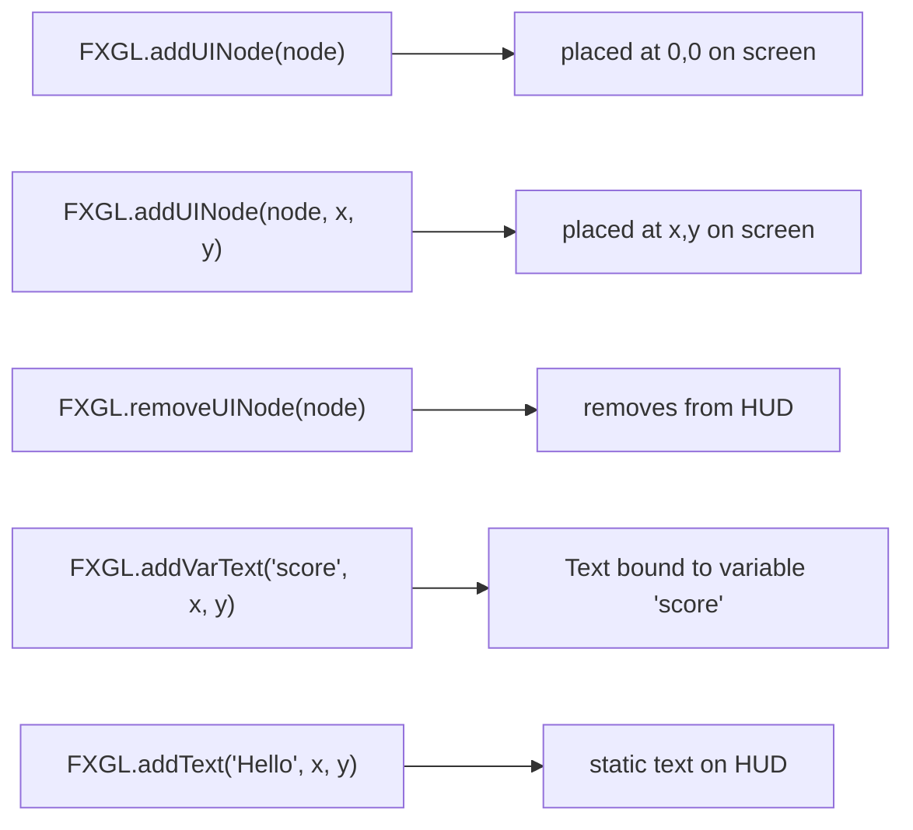
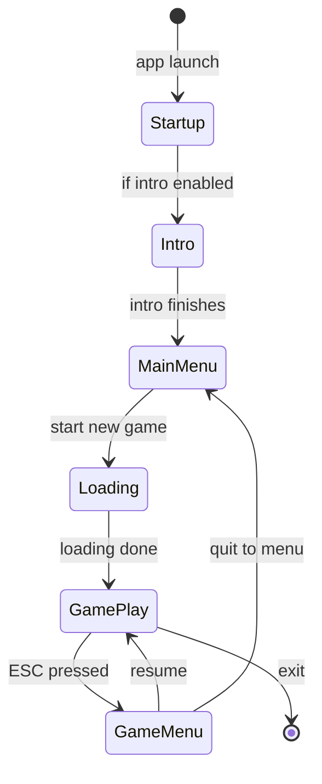
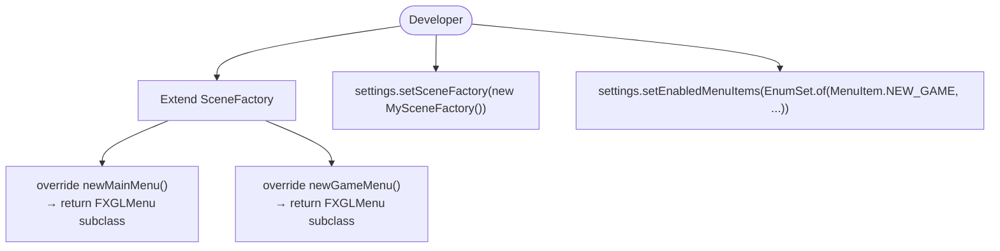
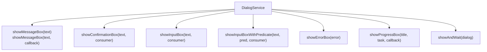
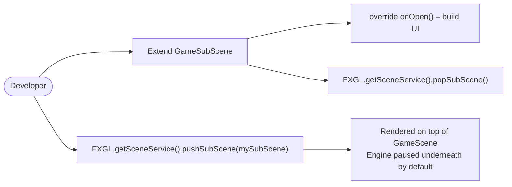
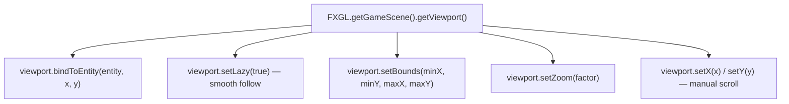
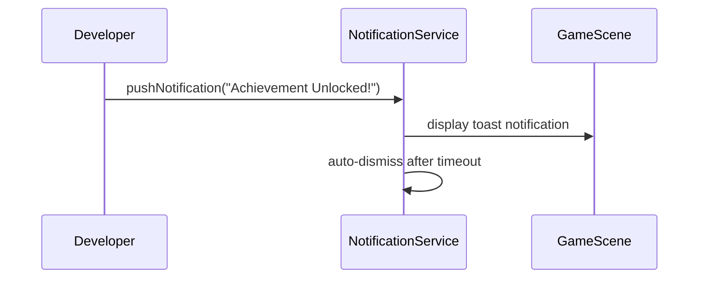
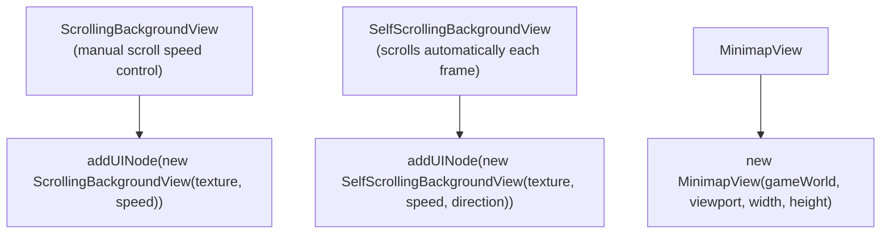
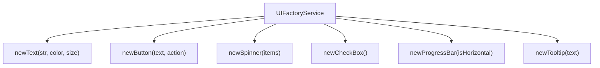

# Use Cases — UI & Scene Management

Covers HUD elements, custom menus, dialogs, notifications, sub-scenes, viewport, and camera follow.

## Actors and Primary Use Cases

## HUD Node Addition

## Scene Lifecycle

## Custom Menu via SceneFactory

## Dialog Use Cases

## GameSubScene (Overlay) Use Case

## Viewport & Camera Follow

## Notification Use Case

## Scrolling & Minimap

## UIFactory Service

