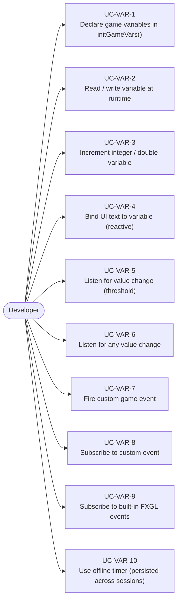
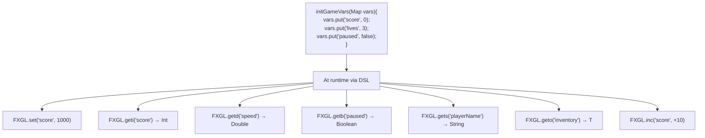
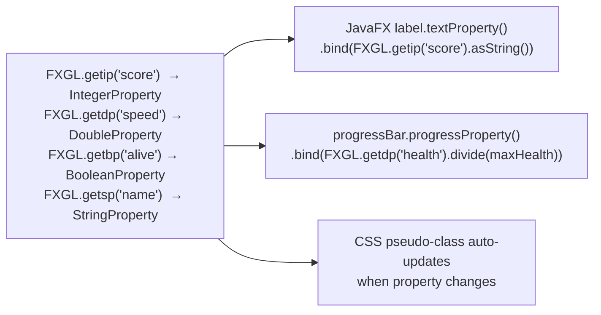
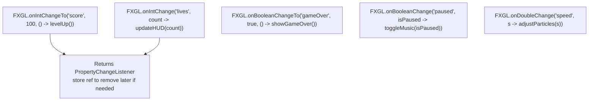
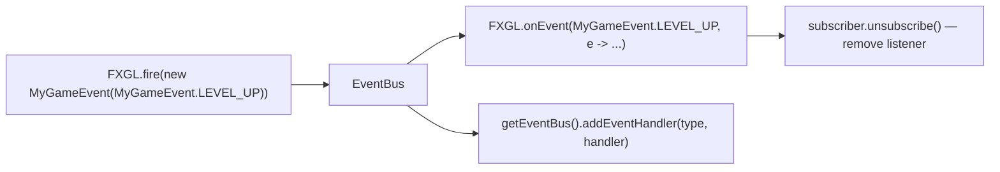
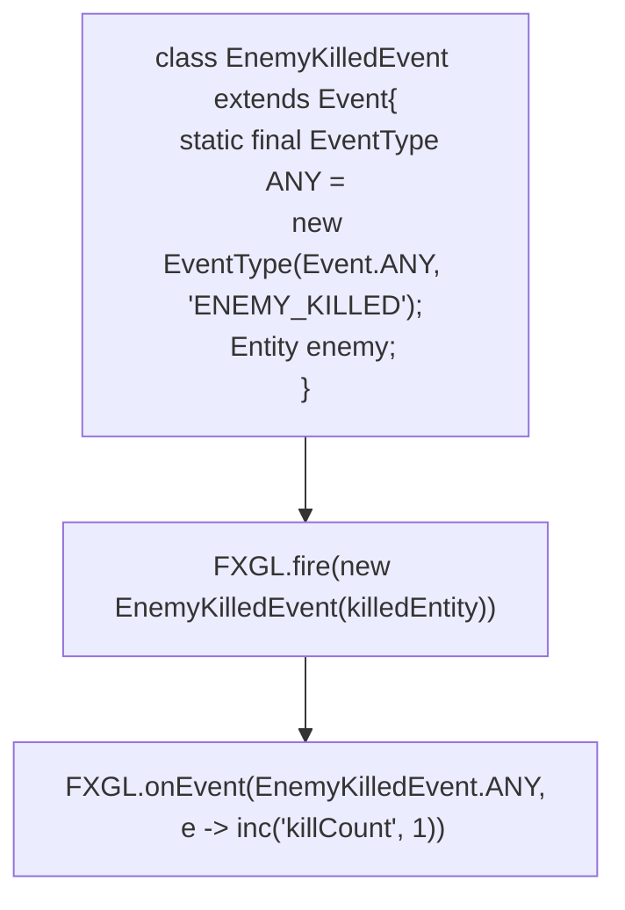
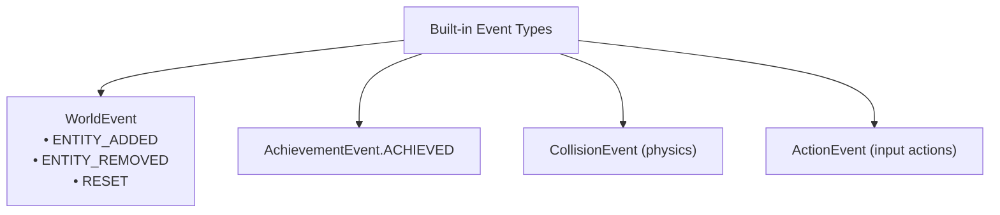
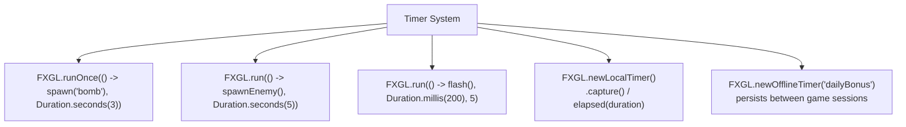

# Use Cases — Variables, Properties & Event Bus

Covers world properties, reactive JavaFX bindings, property change listeners, the event bus,
and custom events.

## Actors and Primary Use Cases

## Variable Declaration and Access

## Reactive Property Binding

## Property Change Listeners

## Event Bus Use Cases

## Custom Event Definition

## Built-in FXGL Events

## Timer Use Cases

