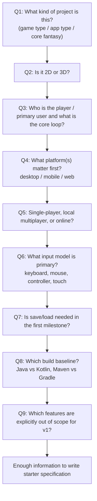

# Project Starter Question Flow

Use a bounded question sequence. Ask **one question at a time** and stop asking once the minimum
starter specification is unblocked.

## Recommended Flow

## Stop Conditions

Stop asking more questions once you can fill:

- project brief
- one ADR for project shape
- one ADR for technical baseline
- core use-case diagram
- initial scaffold choices

## Default Answers if No User Reply

- project type: 2D single-player prototype
- platform: desktop
- input: keyboard
- save/load: no
- language: Java
- build tool: Maven
